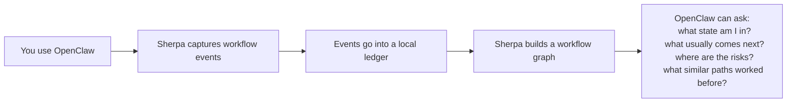
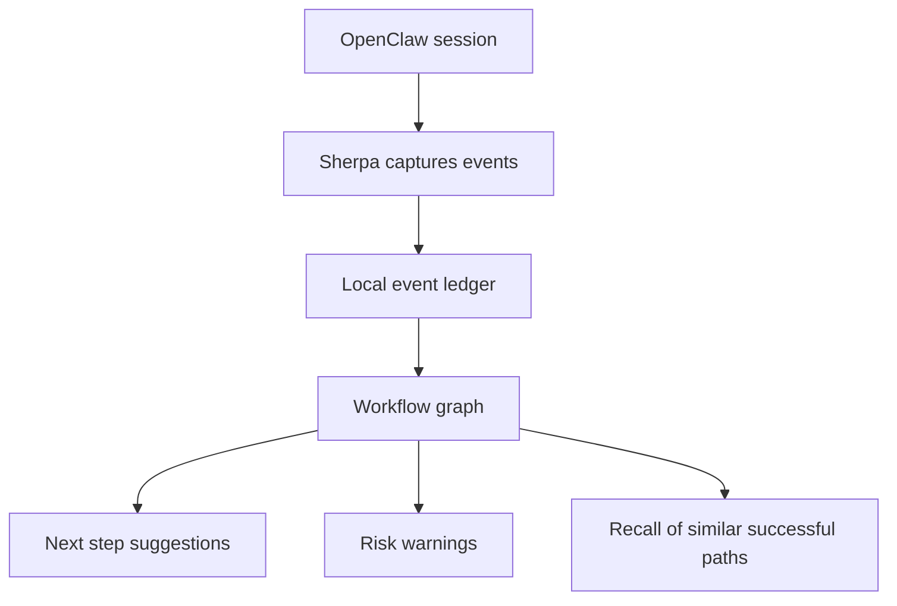

# Sherpa

Sherpa is a procedural memory layer for OpenClaw.

Rather than storing only facts or whole conversations, it models recurring workflow structure:

- what usually comes next
- where tasks often get stuck
- which paths tend to end successfully

It runs locally, watches the workflow events OpenClaw already produces, and derives a compact process memory from them.

The problem it is trying to solve is simple:
as OpenClaw sessions grow longer, useful procedural context is often mixed together with too much conversational surface area.
That makes next-step guidance brittle. Context gets compacted, sessions restart, summaries drift, and the model is left to reconstruct the shape of the work from a noisy partial trace.

## Procedural Memory

OpenClaw is already good at acting inside the current turn.
Sherpa is concerned with continuity across turns and across sessions.

In practice that means:

- suggest likely next steps for the task it is currently in
- warn when a path often leads to failure or stalls
- recall similar past task flows
- keep this memory on your machine instead of sending it to a remote service

## In Practice

You ask OpenClaw to work on something.
Sherpa quietly watches the flow.
Later, on a similar task, Sherpa can say:

- "This usually goes: inspect repo -> patch -> test -> complete."
- "This branch often gets blocked after env checks."
- "The last successful cases took a different path."

It is not trying to be magic.
It is trying to be useful, local, and explainable.

## System Sketch



Sherpa is local-first.
Its working memory is built from typed events such as session starts, messages, tool calls, task boundaries, and task endings.

## Observed Failure Modes

Sherpa is aimed at a fairly specific class of failure in long-running agent sessions.

OpenClaw's own memory troubleshooting material explicitly calls out:

- context overflow and aggressive compaction
- loss of context mid-conversation or after gateway restarts
- memory logs not being written reliably when gateway or filesystem conditions are wrong
- conflicts between some memory features and other interaction modes such as voice

Public bug reports show another adjacent failure mode: state from one session can leak into the next. For example, issue `#58353` reports stale system-summary text being prepended to the first message of a new session after `/new` or `/reset`.

Sherpa does not solve provider outages, gateway crashes, or transport bugs by itself.
What it does is move one important class of memory away from the most brittle substrate.
Instead of asking the model to carry the whole conversational surface in its prompt, Sherpa learns a smaller procedural trace outside the prompt itself.

More concretely, Sherpa is intended to mitigate these pressures:

- compaction pressure: a short typed event path is much cheaper to preserve than a fully expanded conversation
- session contamination: case routing gives memory a narrower unit than "whatever was most recently in context"
- brittle long-horizon continuity: an append-only local ledger survives beyond any single prompt window and can be rebuilt into the same workflow graph
- semantic overreach: next-step guidance is drawn from bounded observed continuations, not an unrestricted retrieval space

Selected sources:

- [OpenClaw memory troubleshooting guide](https://www.getopenclaw.ai/help/memory-search-setup-guide)
- [OpenClaw issue #58353](https://github.com/openclaw/openclaw/issues/58353)
- [OpenClaw issue tracker](https://github.com/openclaw/openclaw/issues)

## Using Sherpa With OpenClaw

### 1. Install the plugin

```bash
openclaw plugins install @sherpa/openclaw
```

### 2. Add a small config block

Copy this into your OpenClaw plugin config for `sherpa`:

```json
{
  "plugins": {
    "entries": {
      "sherpa": {
        "enabled": true,
        "config": {
          "transport": {
            "mode": "embedded"
          },
          "advisory": {
            "enabled": true,
            "injectThreshold": 0.75
          },
          "scope": {
            "default": "deny",
            "rules": [
              { "action": "allow", "match": { "chatType": "direct" } },
              { "action": "allow", "match": { "chatType": "dm" } }
            ]
          }
        }
      }
    }
  }
}
```

A ready-to-copy example also lives at [`docs/examples/openclaw-sherpa.config.json`](./docs/examples/openclaw-sherpa.config.json).

### 3. Restart OpenClaw

That is enough to get Sherpa running.

By default, Sherpa stores data under:

```text
~/.openclaw/agents/{agentId}/sherpa
```

## Conservative Defaults

For most people, start with:

- `transport.mode = embedded`
- advisory enabled
- scope limited to direct messages and DMs
- raw text redaction left on

That gives you the easiest setup and the safest privacy posture.

## A Minimal Example

Without Sherpa:

- OpenClaw handles each task on its own

With Sherpa:

- OpenClaw can recognize "this looks like the same sort of task as before"
- it can suggest the next likely move
- it can warn when a branch often leads to blockage
- it can recall how successful cases finished

## OpenClaw Tools

After install, Sherpa adds these OpenClaw tools:

- `workflow_status`
- `workflow_state`
- `workflow_next`
- `workflow_risks`
- `workflow_recall`
- `workflow_taxonomy`
- `workflow_analytics`
- `workflow_doctor`
- `workflow_rebuild`
- `workflow_export`
- `workflow_gc`

The most useful ones for day-to-day use are:

- `workflow_next`: what usually comes next from here
- `workflow_risks`: where this path often fails or stalls
- `workflow_recall`: similar past paths and how they continued
- `workflow_status`: whether Sherpa is healthy and capturing properly

## Transport Modes

### Simple local setup

Use embedded mode when you want the least setup:

```json
{
  "transport": {
    "mode": "embedded"
  }
}
```

### CLI subprocess mode

Use this if you want the plugin to shell out to the `sherpa` CLI:

```json
{
  "transport": {
    "mode": "stdio",
    "command": "sherpa"
  }
}
```

### Managed HTTP daemon

Use this if you want a warm local process managed by the plugin:

```json
{
  "transport": {
    "mode": "http",
    "baseUrl": "http://127.0.0.1:8787",
    "manageProcess": true
  }
}
```

## Local First

Sherpa is designed to be conservative by default.

- it stores data locally
- raw message text is redacted by default
- scope defaults to deny unless allowed by rules
- you can ignore session patterns entirely
- you can mark some sessions as stateless

If you want Sherpa to remember less, tighten scope rules first.

## Process View



## Mechanism and Theory

Sherpa can be described, a little loosely, as a procedural memory layer for OpenClaw.

It does not try to answer "what do I know about this topic?" and it does not mainly try to answer "what was said before?"
It is closer to:

- what path are we on
- what usually follows this path
- which branches tend to resolve well
- which branches tend to fail or go quiet

This is one answer to a recurring tension in agent systems:
semantic memory is often too broad for moment-to-moment workflow steering, while raw conversation history is too expensive and fragile to carry indefinitely.

The internal model is intentionally structured rather than fuzzy.
Sherpa keeps an append-only local event ledger, then derives a workflow graph from those events.
Recent event suffixes act as the current state; observed continuations become candidate next moves.

Later theory for this project comes from a mix of:

- higher-order Markov models
- de Bruijn-style overlap ideas
- process mining
- graph-shaped memory systems

That academic background matters mostly because it shapes the retrieval behavior:

- advice stays bounded to plausible next branches instead of searching an endless memory space
- repeated workflow phases compress into reusable paths
- suggestions can be explained with support, success, failure, and timing rather than only vague similarity

The design hypothesis is that this changes the failure surface in a useful way:

- if the prompt must be compacted, the learned workflow trace can still persist outside the prompt
- if a session is restarted, the durable ledger still preserves the path that was taken
- if the recent chat surface is noisy, retrieval can still operate over typed transitions rather than raw text similarity
- if memory grows large, bounded event types and typed transitions keep retrieval closer to a process model than a free-form note pile

Sherpa is predictive, not oracular.
It notices regularities in how work tends to unfold.

## For Power Users

Sherpa also ships with:

- a CLI package: [`packages/cli`](./packages/cli)
- an OpenClaw plugin package: [`packages/openclaw`](./packages/openclaw)
- an SDK: [`packages/sdk`](./packages/sdk)
- an MCP server: [`packages/mcp`](./packages/mcp)

If you want the research background, see [`docs/research.pdf`](./docs/research.pdf).

If you want the product spec, see [`prd/sherpa-prd.md`](./prd/sherpa-prd.md).

## Local Development

```bash
pnpm install
pnpm build
pnpm test
pnpm validate-suite --input fixtures/validation/suite.json --max-failing-datasets 10
```

Useful local commands:

```bash
node packages/cli/dist/index.js --root ./.sherpa status
node packages/cli/dist/index.js --root ./.sherpa workflow-next --case-id case-123
node packages/cli/dist/index.js --root ./.sherpa workflow-risks --case-id case-123
node packages/cli/dist/index.js --root ./.sherpa workflow-recall --case-id case-123 --mode successful
node packages/cli/dist/index.js --root ./.sherpa taxonomy-report --recent-days 14 --max-types 50 --max-drift-score 0.2
node packages/cli/dist/index.js --root ./.sherpa analytics-report --limit 10
```

## Current State

Sherpa is already usable and production-oriented, but it is still improving in one important area:
ranking quality.

The system already captures, stores, retrieves, and explains workflow memory well.
The main future gains are in making its suggestions even smarter as validation corpora grow.
